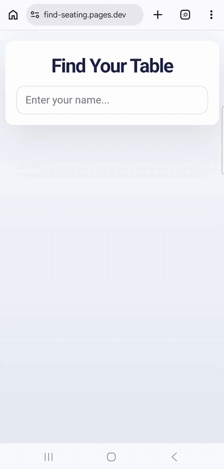
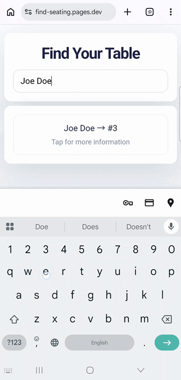
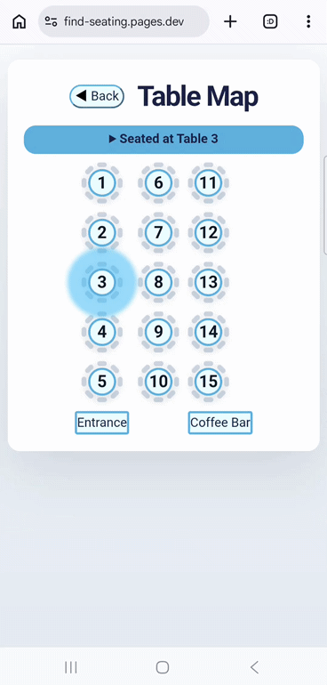

# Seating Chart App

A web app for guests to find their assigned table at an event. The project runs as a Cloudflare Pages site with a D1 database backend.

## About

The web app features name searching, table layout display, table highlighting, and ability to see who is seated at the same table.

### QR Code

Users can be directed to the web app via a QR code.

### Name Search

The first page presents the user with a text box to search by name for their assigned table.

### Result Select

The user can tap the area around the resulting name card to be taken to the table layout display page. The user's assigned table will be highlighted by a growing and shrinking background.

### Seated At Table

The user can tap the "Seated at Table" area to view all the people assigned to the table.

## Development

### Setup

1. Create an Account with Cloudflare Pages
2. Create a Page
3. Create a D1 Database
4. Supply the D1 Database id and name in `wrangler.toml`
5. In the Page, create a Binding called `SEATING_DB` to the D1 Database
6. In the repository root directory, run `npm install` to install `wrangler`
7. Run `npx wrangler login` to connect to your Cloudflare Pages account

### Local Run

1. Run `npx wrangler d1 migrations apply <DATABASE_NAME> --local` to create the database tables and migrate data
2. Run `npm run dev` to start the local server

### Deploy to Production

1. Run `npm run deploy` to deploy your local project to Cloudflare Pages